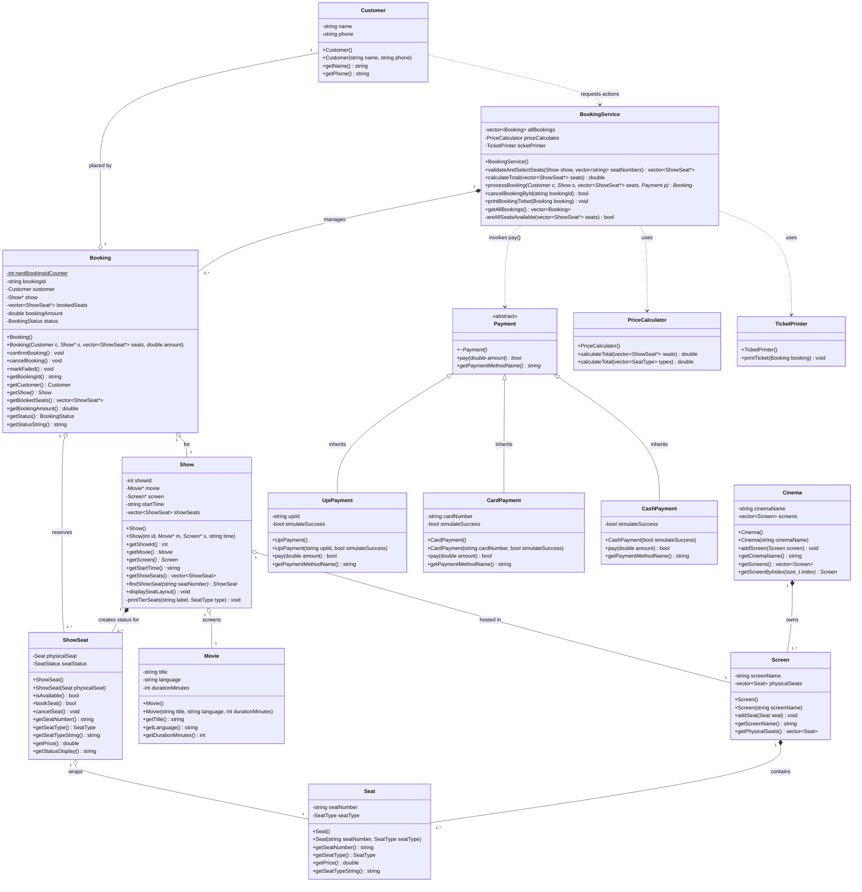
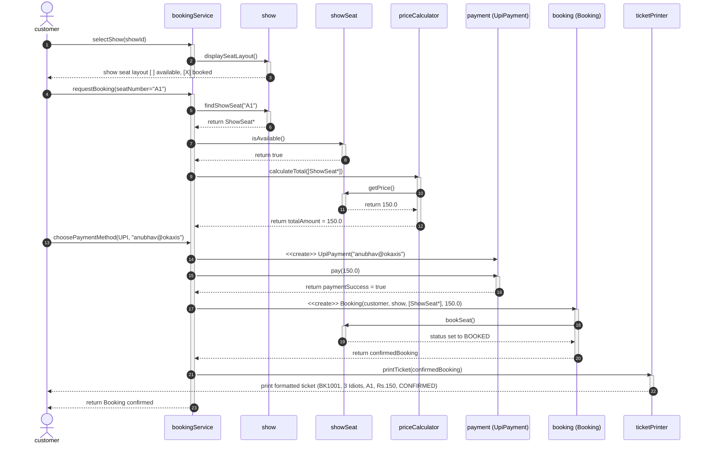

# Assignment 1: Movie Ticket Booking System (Console Application)
**Course**: B.Tech. CSE | **Semester**: 5  
**Subject**: System Design | **Subject Code**: TCS-504  
**Submission Date**: 07-September-2026  

---

## Table of Contents
1. [Item A — Requirement Analysis (FR + NFR)](#item-a--requirement-analysis-fr--nfr)
2. [Item B — Noun–Verb Analysis Table](#item-b--nounverb-analysis-table)
3. [Step C — The Classes You Need (Responsibilities & Boundaries)](#step-c--the-classes-you-need-responsibilities--boundaries)
4. [Item C — Relationship Table with Lifetime Test Justifications](#item-c--relationship-table-with-lifetime-test-justifications)
5. [Item D — UML Class Diagram](#item-d--uml-class-diagram)
6. [Item E — UML Sequence Diagram: Book Seat and Pay by UPI](#item-e--uml-sequence-diagram-book-seat-and-pay-by-upi)
7. [Item F — Modular Source Code Architecture & Demo Run](#item-f--modular-source-code-architecture--demo-run)
8. [Item G — SOLID Principles Mapping & Deliberate Non-Decisions](#item-g--solid-principles-mapping--deliberate-non-decisions)

---

## Item A — Requirement Analysis (FR + NFR)

### Functional Requirements (FR)

* **FR1 — Movie Listing**: The system shall display all movies currently scheduled in the cinema along with their title, language, and runtime duration in minutes. The listing must be dynamically populated and contain no duplicates.
* **FR2 — Show Listing**: For any user-selected movie, the system shall list all scheduled shows displaying auditorium screen identifier (e.g., Screen-1) and start time (e.g., 06:00 PM). If no shows exist for a movie, the system displays an informational message and returns cleanly to the menu.
* **FR3 — Seat Layout Display**: For any user-selected show, the system shall render a categorized 2D seating layout displaying seat tiers (SILVER, GOLD, PLATINUM) with explicit status markers: `[ ]` for AVAILABLE and `[X]` for BOOKED. Seats booked in other shows must not alter this show's availability.
* **FR4 — Booking (Standard)**: A customer selects one or more seat numbers for a show. If any selected seat is already BOOKED, the whole booking is rejected and no seat changes state. Booking is confirmed only after payment succeeds.
* **FR5 — Dynamic Tier Pricing**: The system shall compute booking total strictly by seat category prices: SILVER ₹150, GOLD ₹250, PLATINUM ₹400. An itemized seat-by-seat breakdown and aggregate total must be printed prior to payment processing.
* **FR6 — Payment (Standard)**: Exactly one method (UPI / Card / Cash) per booking. If payment fails, seats are released and booking status becomes FAILED.
* **FR7 — Ticket Issuance**: Upon payment confirmation, the system shall generate and display a formatted ticket containing: unique Booking ID (e.g., `BK1001`), Movie Title, Screen Name, Show Time, comma-separated Seat Numbers, Total Amount paid, and Status (`CONFIRMED`).
* **FR8 — Cancellation & Seat Rollback**: A customer can cancel any confirmed booking using its unique Booking ID. Upon cancellation, the booking status transitions to `CANCELLED`, and all associated seats immediately revert to `AVAILABLE` status for that show.

---

### Non-Functional Requirements (NFR)

* **NFR1 — Modularity (One Class per File, No Headers)**: Code must strictly adhere to the course constraint of one class per file without `.h` / `.hpp` header files, utilizing `#pragma once` and cohesive file-level isolation.
* **NFR2 — Extensibility & Open/Closed Principle**: The payment architecture must allow adding new payment channels (e.g., `NetBankingPayment`, `CryptoPayment`) strictly by subtyping the abstract base class `Payment` without modifying `BookingService` or existing client code.
* **NFR3 — Robustness & Bad Input Handling**: The system must gracefully intercept invalid menu choices, non-existent seat IDs (e.g., `Z99`), out-of-range indices, string inputs when numbers are expected, and input stream termination (EOF) without crashing or looping infinitely.
* **NFR4 — Maintainability & Clean Code**: Every function must perform exactly one task, be restricted to ≤ 20 lines, maintain a maximum of 2 indentation levels, use intention-revealing variable names, and replace magic numbers with explicit compile-time constants (`SILVER_PRICE`, `GOLD_PRICE`, `PLATINUM_PRICE`).

---

## Item B — Noun–Verb Analysis Table

### Problem Statement Analysis
> *"Build a small **movie ticket booking system** for a single **cinema** (like PVR or INOX), as a menu-driven C++ console program.*  
> *A **customer** should be able to see which **movies** are playing, pick a **show**, see which **seats** are free, book **seats**, pay, get a **ticket**, and cancel a **booking**."*

### Noun Analysis Table

| Noun Found | Keep as a Class? | Reason / Design Decision |
| :--- | :---: | :--- |
| **Movie** | **Yes** | Has its own independent state (title, language, duration) and identity. |
| **Seat** | **Yes** | Represents a physical chair in an auditorium with chair number and tier type (SILVER/GOLD/PLATINUM). |
| **"seat layout"** | **No** | It is a visual projection / formatted rendering of a Show's seat statuses, not an independent domain entity → implemented as method `Show::displaySeatLayout()`. |
| **Cinema** | **Yes** | Represents the physical theatre establishment; encapsulates and owns auditorium screens. |
| **Screen** | **Yes** | Represents a physical auditorium hall; owns its physical seating geometry. |
| **Show** | **Yes** | Core aggregate representing a screening event (Movie + Screen + Start Time); manages show-specific seat availability. |
| **ShowSeat** | **Yes** | **Critical Class**: Represents the dynamic booking status (`AVAILABLE`/`BOOKED`) of ONE physical seat for ONE specific show. Physical chair A1 exists once, but its availability varies per show. |
| **Customer** | **Yes** | Represents the person transacting with the system; holds profile data (name, phone). |
| **Booking** | **Yes** | Represents the transaction entity binding customer, show, selected seats, total amount, and lifecycle state (`CONFIRMED`, `CANCELLED`, `FAILED`). |
| **Payment** | **Yes** | Abstract base contract defining polymorphism for checkout strategies (`pay()`). |
| **UpiPayment / CardPayment / CashPayment** | **Yes** | Concrete implementations of the `Payment` contract handling method-specific transaction flows. |
| **Ticket** | **No** | A ticket is a formatted output view of a `Booking`. Storing it as a separate stateful class creates duplicate state; responsibility is assigned to `TicketPrinter`. |
| **TicketPrinter** | **Yes** | Dedicated service class adhering to SRP; formats and prints booking receipts to console. |
| **PriceCalculator** | **Yes** | Dedicated utility/service class responsible for calculating pricing based on seat categories. |
| **BookingService** | **Yes** | High-level orchestration service coordinating validation, seat reservation, payment, and cancellation. |
| **"menu" / "console program"** | **No** | UI flow controller and entrypoint handled in `main.cpp`. |

### Verb Analysis Table (Mapped to Methods)

| Verb in Problem Statement | Associated Class | Method Signature |
| :--- | :--- | :--- |
| *list / see movies* | `main.cpp` / `Movie` | `listAllMovies()`, `Movie::getTitle()` |
| *pick a show* | `main.cpp` / `Show` | `getShowsForMovie()`, `Show::getShowId()` |
| *see which seats are free* | `Show` / `ShowSeat` | `Show::displaySeatLayout()`, `ShowSeat::isAvailable()` |
| *book seats* | `ShowSeat`, `Booking`, `BookingService` | `ShowSeat::bookSeat()`, `Booking::confirmBooking()`, `BookingService::processBooking()` |
| *price booking* | `PriceCalculator` | `PriceCalculator::calculateTotal()` |
| *pay* | `Payment` hierarchy | `Payment::pay(double amount)` |
| *print ticket* | `TicketPrinter` | `TicketPrinter::printTicket(const Booking&)` |
| *cancel booking* | `Booking`, `ShowSeat`, `BookingService` | `Booking::cancelBooking()`, `ShowSeat::cancelSeat()`, `BookingService::cancelBookingById()` |

---

## Step C — The Classes You Need (Responsibilities & Boundaries)

> **Mandatory Assignment Constraint (Pages 3–4)**:  
> *"Your job is to decide each class's data members, methods and access modifiers, and to fill the 'must NOT do' column. For each class also state, in one line each: what it knows, what it does, and what it must NOT do."*

### 1. Class Responsibility & Boundary Matrix

| Class | What It Knows (Data Members / State) | What It Does (Methods & Behavior) | What It Must NOT Do (Design Boundary) |
| :--- | :--- | :--- | :--- |
| **Movie** | `- title: string`<br>`- language: string`<br>`- durationMinutes: int` | `+ getTitle()`<br>`+ getLanguage()`<br>`+ getDurationMinutes()` | Must NOT know about screens, show timings, ticket prices, or booking transactions. |
| **Seat** | `- seatNumber: string`<br>`- seatType: SeatType` | `+ getSeatNumber()`<br>`+ getSeatType()`<br>`+ getPrice()`<br>`+ getSeatTypeString()` | Must NOT store availability or booking status (`isBooked`), as a physical chair is shared across multiple shows. |
| **Screen** | `- screenName: string`<br>`- physicalSeats: vector<Seat>` | `+ addSeat(Seat)`<br>`+ getScreenName()`<br>`+ getPhysicalSeats()` | Must NOT track movie schedules, showtimes, or customer reservations. |
| **Cinema** | `- cinemaName: string`<br>`- screens: vector<Screen>` | `+ addScreen(Screen)`<br>`+ getCinemaName()`<br>`+ getScreens()`<br>`+ getScreenByIndex(size_t)` | Must NOT manage customer payments, ticket printing, or individual seat allocations. |
| **Show** | `- showId: int`<br>`- movie: const Movie*`<br>`- screen: const Screen*`<br>`- startTime: string`<br>`- showSeats: vector<ShowSeat>` | `+ getShowId()`<br>`+ getMovie()`<br>`+ getScreen()`<br>`+ getStartTime()`<br>`+ getShowSeats()`<br>`+ findShowSeat(string)`<br>`+ displaySeatLayout()` | Must NOT process payments, create bookings, or alter physical screen definitions. |
| **ShowSeat** | `- physicalSeat: Seat`<br>`- seatStatus: SeatStatus` | `+ isAvailable()`<br>`+ bookSeat()`<br>`+ cancelSeat()`<br>`+ getSeatNumber()`<br>`+ getPrice()`<br>`+ getStatusDisplay()` | Must NOT store customer details, booking IDs, or process financial payments. |
| **Customer** | `- name: string`<br>`- phone: string` | `+ getName()`<br>`+ getPhone()` | Must NOT manage cinema screens, directly alter seat availability, or generate booking IDs. |
| **Booking** | `- nextBookingIdCounter: static int`<br>`- bookingId: string`<br>`- customer: Customer`<br>`- show: const Show*`<br>`- bookedSeats: vector<ShowSeat*>`<br>`- bookingAmount: double`<br>`- status: BookingStatus` | `+ confirmBooking()`<br>`+ cancelBooking()`<br>`+ markFailed()`<br>`+ getBookingId()`<br>`+ getBookingAmount()`<br>`+ getStatusString()` | Must NOT format tickets for console printing (SRP) or directly process credit cards/UPI. |
| **Payment** *(abstract)* | *None (pure interface)* | `+ virtual pay(double) = 0`<br>`+ virtual getPaymentMethodName() = 0` | Must NOT store booking transaction states or tie itself to a single payment mechanism. |
| **UpiPayment** | `- upiId: string`<br>`- simulateSuccess: bool` | `+ pay(double) override`<br>`+ getPaymentMethodName() override` | Must NOT know about Card details, cash drawers, or cinema seat availability. |
| **CardPayment** | `- cardNumber: string`<br>`- simulateSuccess: bool` | `+ pay(double) override`<br>`+ getPaymentMethodName() override` | Must NOT validate UPI handles, manage cash, or mutate booking records. |
| **CashPayment** | `- simulateSuccess: bool` | `+ pay(double) override`<br>`+ getPaymentMethodName() override` | Must NOT require network calls, banking credentials, or card CVVs. |
| **PriceCalculator** | *None (stateless service)* | `+ calculateTotal(vector<ShowSeat*>)`<br>`+ calculateTotal(vector<SeatType>)` | Must NOT mutate seat availability, print totals, or process transactions. |
| **TicketPrinter** | *None (stateless formatting service)* | `+ printTicket(const Booking&)` | Must NOT alter booking status, recalculate prices, or handle user inputs. |
| **BookingService** | `- allBookings: vector<Booking>`<br>`- priceCalculator: PriceCalculator`<br>`- ticketPrinter: TicketPrinter` | `+ validateAndSelectSeats()`<br>`+ calculateTotal()`<br>`+ processBooking()`<br>`+ cancelBookingById()`<br>`+ printBookingTicket()` | Must NOT directly read console input (`std::cin`) or handle UI menu loops (handled in `main.cpp`). |
| **Cinema/Main Menu** *(in `main.cpp`)* | `- movies: vector<Movie>`<br>`- shows: vector<Show>`<br>`- cinema: Cinema` | `+ handleMovieSelection()`<br>`+ handleBookingFlow()`<br>`+ selectPaymentMethod()`<br>`+ main()` menu loop | Must NOT contain business logic for ticket pricing, seat conflict validation, or payment calculation. |

---

### 2. Architectural Deep-Dive: Why `ShowSeat` and not just `Seat`?

> **Course Evaluation Note (Page 4)**:  
> *"Why ShowSeat and not just Seat? Seat A1 exists once in the screen, but its status is different for every show. A1 may be booked for the 6 PM show and free for the 9 PM show. Status belongs to the show, not to the physical chair. Getting this right is worth real marks."*

* **The Fallacy of Placing Status in `Seat`**:  
  If the `Seat` entity possessed a boolean `isBooked`, then when Customer X books seat `A1` for the 6:00 PM screening of *"3 Idiots"*, `screen1.getSeats()[0].setBooked(true)` would execute. Consequently, when Customer Y later attempts to book seat `A1` for the 9:00 PM screening of *"Interstellar"* in that exact same auditorium, seat `A1` would appear as **already booked**!
* **The Correct Domain Model (`ShowSeat`)**:  
  1. Physical chair `A1` exists **exactly once** in auditorium `Screen-1` (an immutable physical entity with number and tier).
  2. A screening (`Show`) is an event occurring at a specific date and time.
  3. Therefore, seat availability is **temporal**; it belongs to the screening event (`Show`), **not** to the physical chair.
  4. `ShowSeat` acts as a flyweight adapter/wrapper binding one physical `Seat` to its specific state (`AVAILABLE` vs `BOOKED`) within that single `Show`.

---

## Item C — Relationship Table with Lifetime Test Justifications

> **The Lifetime Test Rule**: *"If the whole is destroyed, does the part die?"*  
> If **YES** → **COMPOSITION (◆)**  
> If **NO** → **AGGREGATION (◇)**

| Pair | Your Choice | Your Justification (Applying Lifetime Test) |
| :--- | :---: | :--- |
| **Cinema — Screen** | **COMPOSITION (◆)** | If the Cinema building is demolished, all its auditorium screens inside are destroyed with it. Screens are instantiated within Cinema and cannot exist without it. |
| **Screen — Seat** | **COMPOSITION (◆)** | If an auditorium Screen is torn down, the physical chairs bolted to its floor are destroyed. Seat objects are created and owned directly by Screen. |
| **Show — Movie** | **AGGREGATION (◇)** | *Standard example*: A Show borrows a Movie. If the 6:00 PM show is cancelled, the movie *"3 Idiots"* still exists in the catalog and continues playing at 9:00 PM. Show holds a pointer (`const Movie*`) and never deallocates it. |
| **Show — Screen** | **AGGREGATION (◇)** | If a specific Show screening finishes or is cancelled, the physical auditorium Screen remains intact to host other shows. Show holds only a reference pointer (`const Screen*`). |
| **Show — ShowSeat** | **COMPOSITION (◆)** | A `ShowSeat` represents the seat status *for that specific screening*. If the Show is cancelled or deleted, all its seat availability records die with it. Show owns `vector<ShowSeat>`. |
| **Booking — Customer** | **AGGREGATION (◇)** | If a Booking is cancelled or deleted, the Customer does not die. The customer remains an independent entity who can book other tickets. |
| **Booking — ShowSeat** | **AGGREGATION (◇)** | When a Booking is cancelled or destroyed, the ShowSeats do NOT die; they are released back to `AVAILABLE` for other customers. Booking holds pointers (`vector<ShowSeat*>`). |
| **Booking — Payment** | **ASSOCIATION (──▶)** | Booking collaborates with a Payment instance during checkout to verify receipt of funds. Neither owns the lifetime of the other. |
| **Payment — UpiPayment** | **INHERITANCE (──▷)** | `UpiPayment` is-a specialized `Payment`. It implements the pure virtual method `pay(double)` conforming to the polymorphic payment contract. |
| **BookingService — Booking**| **COMPOSITION (◆)** | `BookingService` manages the lifecycle of `Booking` objects. When the service runtime terminates, its internal booking registry (`vector<Booking>`) is deallocated. |

---

## Item D — UML Class Diagram

### UML Mermaid Diagram



---

## Item E — UML Sequence Diagram: Book Seat and Pay by UPI

Use Case: **"Customer books 1 seat and pays by UPI"** (from choosing a show to ticket printed).



---

## Item F — Modular Source Code Architecture & Demo Run

### File Structure (1 Class Per File, No Headers)

| Filename | Class Defined | Single Responsibility |
| :--- | :--- | :--- |
| `01_Movie.cpp` | `Movie` | Holds movie title, language, and duration metadata. |
| `02_Seat.cpp` | `Seat` | Encapsulates physical chair number and seat tier pricing. |
| `03_Screen.cpp` | `Screen` | Represents an auditorium hall; owns its physical seats. |
| `04_Cinema.cpp` | `Cinema` | Represents the theatre venue; owns its auditorium screens. |
| `05_Show.cpp` | `Show` | Manages screening schedule; generates and displays show seats. |
| `06_ShowSeat.cpp` | `ShowSeat` | Tracks booking status (`AVAILABLE`/`BOOKED`) of one chair for one show. |
| `07_Customer.cpp` | `Customer` | Stores customer identity (name, phone number). |
| `08_Booking.cpp` | `Booking` | Tracks booking transaction, static ID generation, and state rollback. |
| `09_Payment.cpp` | `Payment` | Abstract base class declaring the pure virtual `pay()` contract. |
| `10_PaymentTypes.cpp` | `UpiPayment`, `CardPayment`, `CashPayment` | Concrete payment methods implementing payment execution. |
| `11_PriceCalculator.cpp`| `PriceCalculator` | Computes aggregate billing total from selected seats. |
| `12_TicketPrinter.cpp` | `TicketPrinter` | Formats and prints ticket receipts to console. |
| `13_BookingService.cpp`| `BookingService` | Orchestrates end-to-end seat reservation and payment workflow. |
| `main.cpp` | Console Driver | Houses console menus, input loop, and application setup. |

### Compilation Command
```bash
clang++ -std=c++17 -Wall -Wextra main.cpp -o cinema_app
```

---

### Demo Run 1: Standard Booking Matching Specification (Page 9)
**Input sequence**: Movie 1 (`3 Idiots`) → Show 1 (`06:00 PM`) → Seats `A1,B2` → Pay by `1` (UPI).

```
===== MOVIE TICKET BOOKING =====

1. Movies  2. Book  3. Cancel  4. My tickets  0. Exit
Choose: 1

[1] 3 Idiots       Hindi     170 min
[2] Interstellar   English   169 min

Choose movie: 1
[1] Screen-1  06:00 PM
[2] Screen-2  09:00 PM
Choose show: 1

SCREEN-1  06:00 PM | 3 Idiots
SILVER    A1[ ] A2[X] A3[ ] A4[ ] 
GOLD      B1[ ] B2[ ] B3[X] 
PLATINUM  C1[ ] C2[ ] 

( [ ] = available   [X] = booked )

Seats (e.g. A1,B2): A1,B2
  A1 SILVER Rs.150
  B2 GOLD   Rs.250
  TOTAL     Rs.400

Pay by: 1.UPI  2.Card  3.Cash > 1
[UPI] Rs.400 paid successfully

================ TICKET ================
Booking ID : BK1001
Movie      : 3 Idiots
Screen     : Screen-1   06:00 PM
Seats      : A1, B2
Amount     : Rs.400     Status: CONFIRMED
========================================
```

---

### Demo Run 2: Edge Cases Handled

#### Edge Case 1: Booking an Already Booked Seat (`A2`)
```
Seats (e.g. A1,B2): A2
Error: Seat A2 is already BOOKED.
Booking rejected: Seat selection conflict or invalid seat ID.
```
*Result*: Seat `A2` remains `[X]` and state is unaffected.

#### Edge Case 2: Payment Failure Handling
```
Seats (e.g. A1,B2): A1
  A1 SILVER Rs.150
  TOTAL     Rs.150

Pay by: 1.UPI  2.Card  3.Cash > 4
[UPI] Payment of Rs.150 via fail@bank FAILED!
Payment failed! Booking could NOT be confirmed.
```
*Result*: Seat `A1` remains `[ ]` (`AVAILABLE`) on subsequent view; booking status marked `FAILED`.

#### Edge Case 3: Cancelling a Confirmed Booking (`BK1001`)
```
Choose: 3
Enter Booking ID to cancel (e.g. BK1001): BK1001
Booking BK1001 cancelled successfully. Seats are now AVAILABLE.
```
*Result*: In Show 1 seat layout, seats `A1` and `B2` immediately change from `[X]` back to `[ ]`.

#### Edge Case 4: Invalid Seat Identifier or Menu Input
```
Choose: 99
Invalid choice! Please select an option between 0 and 4.

Seats (e.g. A1,B2): Z99
Error: Seat Z99 does not exist.
Booking rejected: Seat selection conflict or invalid seat ID.
```
*Result*: Clear message, zero crashes, gracefully returns to menu.

#### Edge Case 5: Duplicate Seat Selection (`a1, a1`)
```
Seats (e.g. A1,B2): a1,a1
Error: Duplicate seat A1 in selection.
Booking rejected: Seat selection conflict or invalid seat ID.
```
*Result*: Rejects duplicate seat booking attempt; auto-normalizes case; prevents double billing.

#### Edge Case 6: Attempting to Cancel an Already-Cancelled Booking
```
Choose: 3
Enter Booking ID to cancel (e.g. BK1001): BK1001
Error: Booking BK1001 is already cancelled.
```
*Result*: Distinguishes already-cancelled bookings from non-existent IDs.

---

## Item G — SOLID Principles Mapping & Deliberate Non-Decisions

### 1. SOLID Principles Mapping

| Principle | Where Applied in this System | Implementation Demonstration |
| :--- | :--- | :--- |
| **S — Single Responsibility Principle** | `TicketPrinter` vs `Booking` vs `PriceCalculator` | `Booking` only manages transaction state; it does NOT calculate prices or print console tickets. Formatting changes to the ticket layout only modify `TicketPrinter.cpp`. |
| **O — Open/Closed Principle** | `Payment` Base Class & Subtypes | Adding a new payment method (e.g., `NetBankingPayment`) requires creating a new subclass of `Payment` only. `BookingService::processBooking` does NOT require even a single line of modification. |
| **L — Liskov Substitution Principle** | Polymorphic `Payment*` in `BookingService` | Any derived payment (`UpiPayment`, `CardPayment`, `CashPayment`) can be passed into `BookingService` and invoked via `paymentPtr->pay(amount)` without conditional type checks (`dynamic_cast`) or specialized setup. |
| **I — Interface Segregation Principle** | Lean `Payment` Interface | The `Payment` interface exposes only `pay()` and `getPaymentMethodName()`. It does NOT force non-universal methods like `sendOtp()` or `validateCVV()` that are meaningless for Cash payments. |
| **D — Dependency Inversion Principle** | `BookingService` depends on `Payment` abstraction | `BookingService` accepts an abstract `Payment&` rather than directly creating or depending on concrete implementations like `CardPayment` or `UpiPayment`. |

---

### 2. Deliberate Architectural Decisions ("What We Deliberately Did NOT Do")

1. **We deliberately did NOT store seat booking status inside the physical `Seat` class**:
   * *Rationale*: Physical seat `A1` is a static chair bolted inside `Screen-1`. If `isBooked` were stored in `Seat`, then booking seat `A1` for the 6:00 PM show would incorrectly mark seat `A1` as booked for the 9:00 PM show as well! Booking status belongs strictly to the combination of a seat and a specific show → encapsulated cleanly in `ShowSeat`.

2. **We deliberately did NOT allow `Booking` to format or print its own ticket**:
   * *Rationale*: Giving `Booking` a `printTicket()` method would violate the Single Responsibility Principle by coupling domain state with I/O presentation. Changes to console alignment, currency symbols, or receipt borders should not trigger recompilation of business entities.

3. **We deliberately did NOT force a `refund()` method on the `Payment` base class**:
   * *Rationale*: Cash payments made at a box office counter cannot be automatically refunded via an online API. Forcing `refund()` onto `Payment` would violate the Interface Segregation Principle and Liskov Substitution Principle.
