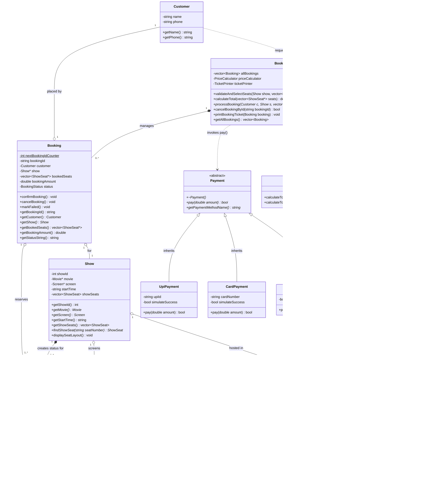
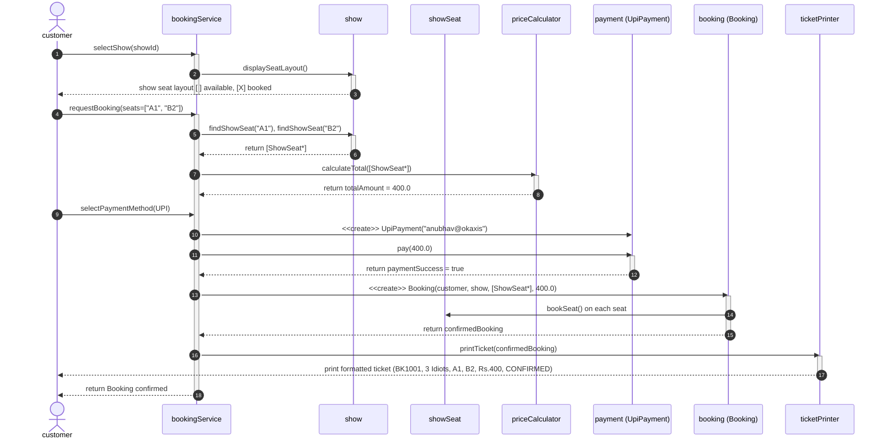

# 🎬 Movie Ticket Booking System

[](https://en.cppreference.com/w/cpp/17)
[](https://github.com/Anubhav-Singh-1234/movie-ticket-booking-system/actions)
[](LICENSE)
[](https://github.com/Anubhav-Singh-1234/movie-ticket-booking-system)
[](https://github.com/Anubhav-Singh-1234/movie-ticket-booking-system)

A robust, menu-driven, object-oriented C++17 console application simulating a complete single cinema ticket booking platform (such as PVR or INOX).

Designed with strict adherence to **Object-Oriented Programming (OOP)**, **SOLID Design Principles**, and production clean-code standards.

---

## 📑 Table of Contents
- [📌 Project Overview](#-project-overview)
- [✨ Features & Implementation Matrix](#-features--implementation-matrix)
- [🚀 Quick Start (Make & Run)](#-quick-start-make--run)
- [🏛️ System Architecture & UML](#️-system-architecture--uml)
  - [UML Class Diagram](#uml-class-diagram)
  - [Sequence Diagram: Booking & Checkout](#sequence-diagram-seat-booking--checkout)
- [📁 Project Structure](#-project-structure)
- [🧠 Key Design Decisions](#-key-design-decisions)
- [🧪 Automated Testing](#-automated-testing)
- [💻 Sample Terminal Walkthrough](#-sample-terminal-walkthrough)
- [📄 License & Author](#-license--author)

---

## 📌 Project Overview

This system manages the end-to-end operational workflow of a multiplex cinema:
1. **Browse Movies**: List currently playing movies with title, language, and runtime duration.
2. **Explore Shows**: View screening schedules by auditorium screen and start time.
3. **Interactive Seat Matrix**: Real-time 2D visual seating layout categorized by tiers (`SILVER`, `GOLD`, `PLATINUM`) with dynamic status indicators (`[ ]` available, `[X]` booked).
4. **Validation & Reservation**: Atomic seat selection that strictly rejects conflicts (already booked seats, duplicates, or non-existent seat numbers).
5. **Tier-Based Pricing**: Dynamic cost computation by seat category:
   - **Silver**: ₹150
   - **Gold**: ₹250
   - **Platinum**: ₹400
6. **Polymorphic Checkout**: Extensible payment processing supporting UPI, Credit/Debit Card, and Cash. Failed payments release reserved seats back to available status.
7. **Ticket Issuance**: Formats and generates booking tickets with a unique identifier (`BK1001`), screen details, and confirmation status.
8. **Cancellation & Rollback**: Allows cancelling confirmed bookings via Booking ID, immediately releasing the seats back into the available pool.

---

## ✨ Features & Implementation Matrix

| Requirement | Feature Description | Implemented In | Status |
|---|---|---|:---:|
| **F1** | List all currently playing movies with language & duration | `01_Movie.cpp`, `main.cpp` | ✅ Completed |
| **F2** | Display shows and screening schedules for selected movie | `05_Show.cpp`, `main.cpp` | ✅ Completed |
| **F3** | Visual 2D seat matrix by tier (`SILVER`, `GOLD`, `PLATINUM`) | `02_Seat.cpp`, `05_Show.cpp` | ✅ Completed |
| **F4** | Multi-seat selection with conflict & duplicate prevention | `13_BookingService.cpp`, `main.cpp` | ✅ Completed |
| **F5** | Dynamic pricing with method overloading | `11_PriceCalculator.cpp` | ✅ Completed |
| **F6** | Polymorphic payment processing (UPI, Card, Cash) with rollback | `09_Payment.cpp`, `10_PaymentTypes.cpp` | ✅ Completed |
| **F7** | Formatted ticket generation with unique static ID counter | `08_Booking.cpp`, `12_TicketPrinter.cpp` | ✅ Completed |
| **F8** | Booking cancellation by ID and real-time seat release | `08_Booking.cpp`, `13_BookingService.cpp` | ✅ Completed |
| **Bonus** | Case-insensitive seat input parsing (`a1, b2` -> `A1, B2`) | `main.cpp` | ✅ Completed |
| **Bonus** | Duplicate seat entry rejection in single line input | `13_BookingService.cpp` | ✅ Completed |
| **Bonus** | Automated CI pipeline & bash test suite | `.github/workflows/ci.yml`, `test_demo.sh` | ✅ Completed |

---

## 🚀 Quick Start (Make & Run)

### Option 1: Using Make (Recommended)

```bash
# 1. Clone the repository
git clone https://github.com/Anubhav-Singh-1234/movie-ticket-booking-system.git
cd movie-ticket-booking-system

# 2. Build the binary
make

# 3. Launch interactive CLI
make run

# 4. Run automated test suite
make test

# 5. Clean build artifacts
make clean
```

### Option 2: Using Modern CMake

```bash
cmake -B build
cmake --build build
./build/cinema_app
```

### Option 3: Direct Clang++ or G++ Compilation

```bash
clang++ -std=c++17 -Wall -Wextra -pedantic -O2 main.cpp -o cinema_app
./cinema_app
```

---

## 🏛️ System Architecture & UML

### UML Class Diagram


---

### Sequence Diagram: Seat Booking & Checkout


---

## 📁 Project Structure

Strict modular structure adhering to **one class per file, no header files** rule:

```
movie-ticket-booking-system/
├── .github/
│   └── workflows/
│       └── ci.yml             # GitHub Actions CI build & verification matrix
├── 01_Movie.cpp               # Movie entity (title, language, duration)
├── 02_Seat.cpp                # Physical seat & tier pricing definitions
├── 03_Screen.cpp              # Auditorium screen (owns physical seats)
├── 04_Cinema.cpp              # Cinema venue (owns auditoriums)
├── 05_Show.cpp                # Show screening & layout renderer
├── 06_ShowSeat.cpp            # Status (AVAILABLE/BOOKED) of one seat for one show
├── 07_Customer.cpp            # Customer profile model
├── 08_Booking.cpp             # Booking transaction with unique static ID counter
├── 09_Payment.cpp             # Abstract base class for payment strategy
├── 10_PaymentTypes.cpp        # UpiPayment, CardPayment, CashPayment implementations
├── 11_PriceCalculator.cpp     # Dynamic total calculation (Method Overloading)
├── 12_TicketPrinter.cpp       # Formats and displays tickets (Single Responsibility)
├── 13_BookingService.cpp      # Orchestrator for booking flow & cancellations
├── main.cpp                   # Interactive console driver and menu loop
├── Makefile                   # Production build automation targets (build, run, test)
├── CMakeLists.txt             # Cross-platform CMake configuration
├── test_demo.sh               # Non-interactive automated test suite
├── ASSIGNMENT_1_SUBMISSION.md # Comprehensive design report and theoretical analysis
├── LICENSE                    # MIT Open-Source License
├── .gitignore                 # Excludes binaries and OS files
└── README.md                  # Project documentation & guides
```

---

## 🧠 Key Design Decisions

### 1. Why `ShowSeat` and not just `Seat`?
A physical seat `A1` exists permanently in `Screen-1`. However, its availability is time-dependent: it may be **BOOKED** for the 6:00 PM show, but **AVAILABLE** for the 9:00 PM show. Attaching booking status directly to `Seat` would cause different shows in the same screen to overwrite each other. Status belongs to the screening, which is encapsulated cleanly inside `ShowSeat`.

### 2. SOLID Principles Applied
- **Single Responsibility (SRP)**: `TicketPrinter` handles ticket formatting only; `PriceCalculator` calculates pricing only; `Booking` stores transaction state only.
- **Open/Closed (OCP)**: Adding new payment methods (e.g., `NetBankingPayment`) requires creating a new subclass of `Payment` without modifying `BookingService`.
- **Liskov Substitution (LSP)**: All payment subclasses can be passed interchangeably via `Payment*` without runtime type assertions.
- **Interface Segregation (ISP)**: The `Payment` interface is lean (`pay()`, `getPaymentMethodName()`) and does not force methods like `refund()` or `validateCVV()` that do not apply to Cash transactions.
- **Dependency Inversion (DIP)**: `BookingService` depends on the abstract `Payment&` reference, decoupling it from concrete payment gateways.

---

## 🧪 Automated Testing

The repository comes equipped with an automated non-interactive regression test suite in `test_demo.sh` run via `make test`:

```bash
$ make test
./test_demo.sh
======================================================
  Running Movie Ticket Booking System Test Suite      
======================================================
Test 1: Booking Flow & Ticket Generation (Seats: A1, B2)... PASSED
Test 2: Collision Rejection for Already Booked Seats (A2)... PASSED
Test 3: Duplicate Seat Handling ('a3, A3')... PASSED
Test 4: Booking Cancellation (BK1001 Rollback)... PASSED
Test 5: Payment Failure Rollback Simulation (Option 4)... PASSED
------------------------------------------------------
All 5 tests passed successfully!
```

---

## 💻 Sample Terminal Walkthrough

```
===== MOVIE TICKET BOOKING =====

1. Movies  2. Book  3. Cancel  4. My tickets  0. Exit
Choose: 1

[1] 3 Idiots       Hindi     170 min
[2] Interstellar   English   169 min

Choose movie: 1
[1] Screen-1  06:00 PM
[2] Screen-2  09:00 PM
Choose show: 1

SCREEN-1  06:00 PM | 3 Idiots
SILVER    A1[ ] A2[X] A3[ ] A4[ ] 
GOLD      B1[ ] B2[ ] B3[X] 
PLATINUM  C1[ ] C2[ ] 

( [ ] = available   [X] = booked )

Seats (e.g. A1,B2): A1,B2
  A1 SILVER Rs.150
  B2 GOLD   Rs.250
  TOTAL     Rs.400

Pay by: 1.UPI  2.Card  3.Cash > 1
[UPI] Rs.400 paid successfully

================ TICKET ================
Booking ID : BK1001
Movie      : 3 Idiots
Screen     : Screen-1   06:00 PM
Seats      : A1, B2
Amount     : Rs.400     Status: CONFIRMED
========================================
```

---

## 📄 License & Author

- **Author**: Anubhav Singh ([@Anubhav-Singh-1234](https://github.com/Anubhav-Singh-1234))
- **Course**: B.Tech CSE — TCS-504 System Design
- **License**: Licensed under the open-source [MIT License](LICENSE).
